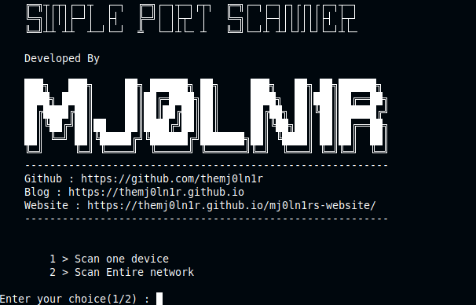

# Port_Scanner

This is a basic computer networking based project. The script is developed using python which can perform following tasks.

	1. Scanning open ports on a single target
	2. Scanning open ports in every system in a network


I devoloped this script with less additional modules this can be executed in any system without any additional requirements.This scanning process will take less time. 
### Requirements

You may require some python modules

	1. subprocess
	2. socket
	3. platform
    4. threading
    5. sys

These modules will be pre installed on every system, if not then install them with `pip3 or pip`
### Installation

```text 
git clone https://github.com/TheMj0ln1r/Port_Scanner.git
cd Port_Scanner
python3 Port_Scanner.py
```



> If anything should be modified in the script please let me know.

If you want to learn more about my tool you can found it on my blog.


##### Doveloped by Mj0ln1r
##### Website : https://themj0ln1r.github.io/mj0ln1rs-website/
##### Blog : https://themj0ln1r.github.io
